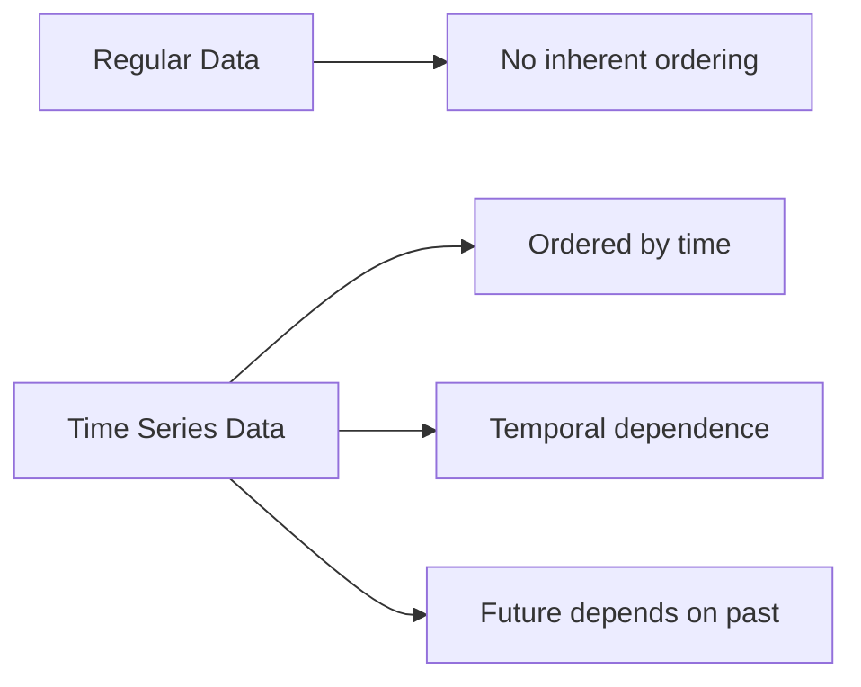
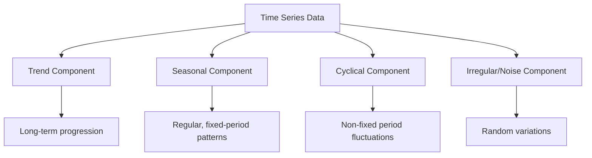
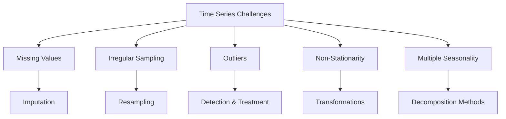

# Introduction to Time Series

## Learning Objectives
- Understand what time series data is and how it differs from other data types
- Identify the key components of time series data: trend, seasonality, cyclical patterns, and noise
- Learn basic techniques for loading, visualizing, and exploring time series data in Python

## What is Time Series Data?

Time series data consists of observations collected sequentially over time. Unlike regular data, the ordering of observations matters significantly. Each data point is associated with a specific timestamp, creating a temporal relationship between observations.



### Examples of Time Series Data

Time series data appears in many domains:

- **Finance**: Stock prices, exchange rates, trading volumes
- **Economics**: GDP growth, unemployment rates, inflation
- **Weather**: Temperature, precipitation, humidity
- **Energy**: Electricity consumption, renewable energy production
- **Retail**: Sales data, inventory levels, web traffic
- **Healthcare**: Patient vitals, disease spread, hospital admissions

## Components of Time Series

A time series typically consists of four main components:



### Trend

The trend represents the long-term progression of the series - whether it's increasing, decreasing, or remaining stable over time. It shows the general direction in which the data is moving.

### Seasonality

Seasonality refers to regular patterns that repeat at fixed intervals. These can be:
- Daily patterns (e.g., website traffic peaking during certain hours)
- Weekly patterns (e.g., sales increasing on weekends)
- Monthly or quarterly patterns (e.g., higher retail sales during holidays)
- Yearly patterns (e.g., ice cream sales increasing in summer)

### Cyclical Component

Cyclical patterns are similar to seasonal patterns but occur at non-fixed intervals. They're often related to business or economic cycles and may span multiple years.

### Irregular Component (Noise)

This represents random variations that cannot be attributed to trend, seasonal, or cyclical factors. These are unpredictable fluctuations in the data.

## Getting Started with Time Series Analysis in Python

Let's set up our Python environment and learn how to load and visualize time series data.

### Required Libraries

```python
# Essential libraries for time series analysis
import pandas as pd
import numpy as np
import matplotlib.pyplot as plt
import seaborn as sns
from statsmodels.graphics.tsaplots import plot_acf, plot_pacf
```

### Loading Time Series Data

Time series data often comes in various formats. Here's how to load and prepare a simple CSV file:

```python
# Load time series data
df = pd.read_csv('data/daily_temperature.csv')

# Convert date column to datetime
df['date'] = pd.to_datetime(df['date'])

# Set date as index
df.set_index('date', inplace=True)

# Display first few rows
print(df.head())
```

### Basic Time Series Visualization

Visualizing your time series is a crucial first step in analysis:

```python
# Plot the time series
plt.figure(figsize=(12, 6))
plt.plot(df.index, df['temperature'])
plt.title('Daily Temperature Over Time')
plt.xlabel('Date')
plt.ylabel('Temperature (°C)')
plt.grid(True)
plt.tight_layout()
plt.show()
```

## Basic Exploration Techniques

### Checking for Missing Values

Missing values in time series can significantly impact analysis:

```python
# Check for missing values
print(f"Missing values: {df.isnull().sum()}")

# If there are missing values, you can fill them
# Method 1: Forward fill (use previous valid observation)
df_filled = df.fillna(method='ffill')

# Method 2: Interpolation
df_filled = df.interpolate()
```

### Resampling Time Series Data

Changing the frequency of your time series (daily to monthly, etc.):

```python
# Resample to monthly average
monthly_data = df['temperature'].resample('M').mean()

# Plot original vs monthly data
plt.figure(figsize=(12, 6))
plt.plot(df.index, df['temperature'], 'b-', alpha=0.5, label='Daily')
plt.plot(monthly_data.index, monthly_data, 'r-', label='Monthly Average')
plt.title('Daily vs Monthly Temperature')
plt.legend()
plt.grid(True)
plt.show()
```

### Examining Autocorrelation

Autocorrelation helps us understand how a time series is correlated with its past values:

```python
# Plot autocorrelation
plt.figure(figsize=(12, 6))
plot_acf(df['temperature'], lags=30)
plt.title('Autocorrelation of Temperature Data')
plt.show()
```

## Time Series Patterns Visualization

Let's visualize a time series to identify its components:

```python
# Generate sample data with trend and seasonality
dates = pd.date_range(start='2020-01-01', periods=365, freq='D')
trend = np.linspace(0, 10, 365)  # Increasing trend
seasonality = 5 * np.sin(np.linspace(0, 2*np.pi*4, 365))  # Seasonal pattern
noise = np.random.normal(0, 1, 365)  # Random noise

# Combine components
y = trend + seasonality + noise

# Create a DataFrame
sample_df = pd.DataFrame({'value': y}, index=dates)

# Plot the components
plt.figure(figsize=(12, 10))

# Original data
plt.subplot(4, 1, 1)
plt.plot(sample_df.index, sample_df['value'])
plt.title('Original Time Series')
plt.grid(True)

# Trend
plt.subplot(4, 1, 2)
plt.plot(sample_df.index, trend)
plt.title('Trend Component')
plt.grid(True)

# Seasonality
plt.subplot(4, 1, 3)
plt.plot(sample_df.index, seasonality)
plt.title('Seasonal Component')
plt.grid(True)

# Noise
plt.subplot(4, 1, 4)
plt.plot(sample_df.index, noise)
plt.title('Noise Component')
plt.grid(True)

plt.tight_layout()
plt.show()
```

## Exploratory Analysis Techniques

### Seasonal Plots

Visualizing data by seasons to identify patterns:

```python
# Create a seasonal plot for monthly data
monthly_data = sample_df.copy()
monthly_data['month'] = monthly_data.index.month
monthly_data['year'] = monthly_data.index.year

plt.figure(figsize=(12, 6))
for year, data in monthly_data.groupby('year'):
    plt.plot(data['month'], data['value'], label=f'Year {year}')

plt.title('Monthly Values by Year')
plt.xlabel('Month')
plt.ylabel('Value')
plt.grid(True)
plt.legend()
plt.xticks(range(1, 13))
plt.show()
```

### Box Plots by Time Period

```python
# Box plot by month
plt.figure(figsize=(12, 6))
sns.boxplot(x=monthly_data['month'], y=monthly_data['value'])
plt.title('Value Distribution by Month')
plt.xlabel('Month')
plt.ylabel('Value')
plt.grid(True)
plt.show()
```

## Common Challenges in Time Series Analysis



1. **Non-stationarity**: Most statistical methods assume that time series data is stationary (constant mean and variance over time).
2. **Seasonality**: Multiple seasonal patterns can complicate analysis.
3. **Missing data**: Time series often has gaps that need appropriate handling.
4. **Outliers**: Extreme values can significantly affect modeling.
5. **Overfitting**: Models might perform well on historical data but fail on new data.

## Applications of Time Series Analysis

Time series analysis has numerous practical applications:

1. **Forecasting**: Predicting future values based on historical patterns
2. **Anomaly detection**: Identifying unusual patterns in data
3. **Pattern recognition**: Understanding recurring behaviors
4. **Causal analysis**: Determining relationships between different time series

## Summary

In this introduction, we've covered:
- The definition and characteristics of time series data
- Key components: trend, seasonality, cyclical patterns, and noise
- Basic techniques for loading and visualizing time series data
- Initial exploratory analysis methods

In the next lesson, we'll dive deeper into trend analysis, exploring various methods to identify, measure, and model trends in time series data.

## Exercise

1. Load a time series dataset of your choice (like stock prices, temperature data, etc.)
2. Create a basic visualization of the time series
3. Resample the data to a different frequency (e.g., daily to weekly)
4. Identify potential trend and seasonal patterns visually

## Further Reading

- [Time Series Analysis in Python](https://machinelearningmastery.com/time-series-data-visualization-with-python/)
- [Introduction to Time Series Analysis](https://otexts.com/fpp3/intro.html)
- [Pandas Time Series Documentation](https://pandas.pydata.org/pandas-docs/stable/user_guide/timeseries.html)
