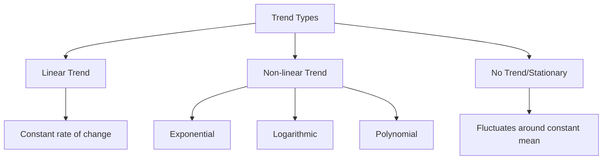
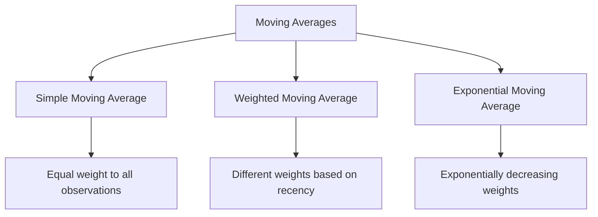
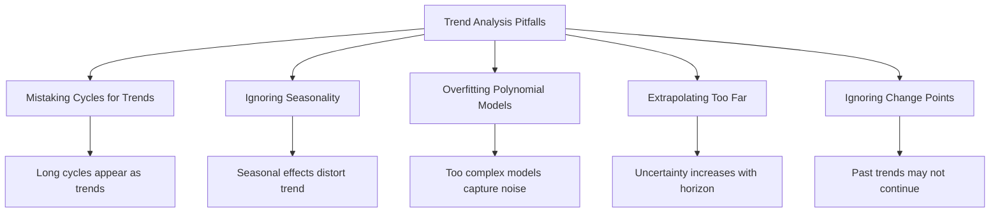

# Understanding Trend in Time Series

## Learning Objectives
- Understand what a trend component is and why it matters in time series analysis
- Learn techniques to identify and visualize trends in time series data
- Master methods for trend estimation and removal
- Apply different forecasting techniques for trend prediction

## What is a Trend Component?

A trend represents the long-term movement or direction in time series data. It shows the underlying pattern of growth or decline, indicating whether a series is generally increasing, decreasing, or remaining stable over time, ignoring short-term fluctuations.



### Why Trend Analysis Matters

Analyzing trends is crucial because:
- It reveals the long-term direction of your data
- It helps in making strategic decisions based on long-term patterns
- It's often a prerequisite for further time series modeling
- It can be used for long-term forecasting

## Visualizing and Identifying Trends

The first step in trend analysis is visual inspection.

```python
import pandas as pd
import numpy as np
import matplotlib.pyplot as plt
import seaborn as sns
from statsmodels.tsa.seasonal import seasonal_decompose

# Load sample data
df = pd.read_csv('data/monthly_sales.csv')
df['date'] = pd.to_datetime(df['date'])
df.set_index('date', inplace=True)

# Plot the time series
plt.figure(figsize=(12, 6))
plt.plot(df.index, df['sales'])
plt.title('Monthly Sales Data')
plt.xlabel('Date')
plt.ylabel('Sales (Units)')
plt.grid(True)
plt.show()
```

### Using First Differences to Identify Trends

Calculating the difference between consecutive observations can help identify trends:

```python
# Calculate first difference
df['sales_diff'] = df['sales'].diff()

# Plot original data and first difference
fig, ax = plt.subplots(2, 1, figsize=(12, 8))
ax[0].plot(df.index, df['sales'])
ax[0].set_title('Original Sales Data')
ax[0].grid(True)

ax[1].plot(df.index, df['sales_diff'])
ax[1].set_title('First Difference of Sales')
ax[1].axhline(y=0, color='r', linestyle='-', alpha=0.3)
ax[1].grid(True)

plt.tight_layout()
plt.show()
```

- If the first difference fluctuates around zero, the original series may have a constant trend
- If the first difference shows a pattern, the original series may have a non-linear trend

## Trend Estimation Techniques

Let's explore various methods to estimate the trend component.

### 1. Moving Averages

Moving average smooths out short-term fluctuations to highlight longer-term trends.

```python
# Calculate simple moving averages with different window sizes
df['MA_7'] = df['sales'].rolling(window=7).mean()
df['MA_30'] = df['sales'].rolling(window=30).mean()
df['MA_90'] = df['sales'].rolling(window=90).mean()

# Plot original data with moving averages
plt.figure(figsize=(12, 6))
plt.plot(df.index, df['sales'], 'b-', alpha=0.5, label='Original')
plt.plot(df.index, df['MA_7'], 'r-', label='7-Day MA')
plt.plot(df.index, df['MA_30'], 'g-', label='30-Day MA')
plt.plot(df.index, df['MA_90'], 'k-', label='90-Day MA')
plt.title('Sales Data with Moving Averages')
plt.xlabel('Date')
plt.ylabel('Sales')
plt.legend()
plt.grid(True)
plt.show()
```

#### Types of Moving Averages



### 2. Polynomial Fitting

For non-linear trends, we can fit polynomial functions:

```python
# Create a numeric index for fitting
df['numeric_index'] = np.arange(len(df))

# Fit polynomials of different degrees
x = df['numeric_index']
y = df['sales']

# Linear trend (degree 1)
z1 = np.polyfit(x, y, 1)
p1 = np.poly1d(z1)

# Quadratic trend (degree 2)
z2 = np.polyfit(x, y, 2)
p2 = np.poly1d(z2)

# Cubic trend (degree 3)
z3 = np.polyfit(x, y, 3)
p3 = np.poly1d(z3)

# Plot the data and the trend lines
plt.figure(figsize=(12, 6))
plt.plot(df.index, y, 'b.', alpha=0.5, label='Original')
plt.plot(df.index, p1(x), 'r-', label=f'Linear: {z1[0]:.2f}x + {z1[1]:.2f}')
plt.plot(df.index, p2(x), 'g-', label='Quadratic')
plt.plot(df.index, p3(x), 'k-', label='Cubic')
plt.title('Sales with Polynomial Trends')
plt.xlabel('Date')
plt.ylabel('Sales')
plt.legend()
plt.grid(True)
plt.show()
```

### 3. LOESS/LOWESS Smoothing

Locally Estimated Scatterplot Smoothing (LOESS) is a non-parametric method that fits multiple regressions in local neighborhoods:

```python
from statsmodels.nonparametric.smoothers_lowess import lowess

# Apply LOWESS smoothing
# The frac parameter controls the smoothness (0 to 1)
lowess_result = lowess(df['sales'], df['numeric_index'], frac=0.1)

# Plot original data with LOWESS trend
plt.figure(figsize=(12, 6))
plt.plot(df.index, df['sales'], 'b-', alpha=0.5, label='Original')
plt.plot(df.index, lowess_result[:, 1], 'r-', label='LOWESS Trend')
plt.title('Sales with LOWESS Trend')
plt.xlabel('Date')
plt.ylabel('Sales')
plt.legend()
plt.grid(True)
plt.show()
```

### 4. Decomposition Methods

Time series decomposition separates the original data into trend, seasonal, and residual components:

```python
# Apply seasonal decomposition
decomposition = seasonal_decompose(df['sales'], model='additive', period=12)

# Plot the decomposition
fig, (ax1, ax2, ax3, ax4) = plt.subplots(4, 1, figsize=(12, 10))
decomposition.observed.plot(ax=ax1)
ax1.set_title('Original Data')
ax1.grid(True)

decomposition.trend.plot(ax=ax2)
ax2.set_title('Trend Component')
ax2.grid(True)

decomposition.seasonal.plot(ax=ax3)
ax3.set_title('Seasonal Component')
ax3.grid(True)

decomposition.resid.plot(ax=ax4)
ax4.set_title('Residuals')
ax4.grid(True)

plt.tight_layout()
plt.show()
```

## Detrending Methods

Detrending is removing the trend component from time series data, which is often necessary for further analysis.

### 1. Differencing

```python
# First-order differencing
df['diff_1'] = df['sales'].diff()

# Second-order differencing (if needed)
df['diff_2'] = df['diff_1'].diff()

# Plot
plt.figure(figsize=(12, 8))
plt.subplot(3, 1, 1)
plt.plot(df.index, df['sales'])
plt.title('Original Sales Data')
plt.grid(True)

plt.subplot(3, 1, 2)
plt.plot(df.index, df['diff_1'])
plt.title('First-Order Differenced Data')
plt.grid(True)

plt.subplot(3, 1, 3)
plt.plot(df.index, df['diff_2'])
plt.title('Second-Order Differenced Data')
plt.grid(True)

plt.tight_layout()
plt.show()
```

### 2. Trend Removal via Regression

```python
# Remove linear trend
df['detrended_linear'] = df['sales'] - p1(df['numeric_index'])

# Remove polynomial trend
df['detrended_poly'] = df['sales'] - p3(df['numeric_index'])

# Plot detrended data
plt.figure(figsize=(12, 8))
plt.subplot(3, 1, 1)
plt.plot(df.index, df['sales'])
plt.title('Original Sales Data')
plt.grid(True)

plt.subplot(3, 1, 2)
plt.plot(df.index, df['detrended_linear'])
plt.title('Linear Detrended Data')
plt.grid(True)

plt.subplot(3, 1, 3)
plt.plot(df.index, df['detrended_poly'])
plt.title('Polynomial Detrended Data')
plt.grid(True)

plt.tight_layout()
plt.show()
```

## Measuring Trend Strength

Measuring the strength of a trend helps quantify its significance in the data.

### 1. Statistical Tests for Trend

The Mann-Kendall test is commonly used to detect trends:

```python
from pymannkendall import original_test

# Apply Mann-Kendall test
result = original_test(df['sales'])
print(f"Mann-Kendall Test Results:")
print(f"Trend: {result.trend}")
print(f"p-value: {result.p}")
print(f"Tau: {result.Tau}")  # Correlation coefficient
```

### 2. R-squared from Trend Models

R-squared measures how well the trend model fits the data:

```python
from sklearn.metrics import r2_score

# Calculate R-squared for different trend models
linear_r2 = r2_score(df['sales'], p1(df['numeric_index']))
quad_r2 = r2_score(df['sales'], p2(df['numeric_index']))
cubic_r2 = r2_score(df['sales'], p3(df['numeric_index']))

print(f"R-squared values:")
print(f"Linear trend: {linear_r2:.4f}")
print(f"Quadratic trend: {quad_r2:.4f}")
print(f"Cubic trend: {cubic_r2:.4f}")
```

## Trend Forecasting

Let's look at methods specifically for forecasting trends.

### 1. Simple Extrapolation

```python
# Create future dates for forecasting
last_date = df.index[-1]
future_dates = pd.date_range(start=last_date, periods=12, freq='M')[1:]
future_indices = np.arange(len(df), len(df) + len(future_dates))

# Forecast using polynomial models
linear_forecast = p1(future_indices)
quad_forecast = p2(future_indices)
cubic_forecast = p3(future_indices)

# Create forecast DataFrame
forecast_df = pd.DataFrame({
    'date': future_dates,
    'linear_forecast': linear_forecast,
    'quad_forecast': quad_forecast,
    'cubic_forecast': cubic_forecast
})
forecast_df.set_index('date', inplace=True)

# Plot historical data and forecasts
plt.figure(figsize=(12, 6))
plt.plot(df.index, df['sales'], 'b-', label='Historical Data')
plt.plot(forecast_df.index, forecast_df['linear_forecast'], 'r--', label='Linear Forecast')
plt.plot(forecast_df.index, forecast_df['quad_forecast'], 'g--', label='Quadratic Forecast')
plt.plot(forecast_df.index, forecast_df['cubic_forecast'], 'k--', label='Cubic Forecast')
plt.title('Sales Trend Forecasting')
plt.xlabel('Date')
plt.ylabel('Sales')
plt.legend()
plt.grid(True)
plt.show()
```

### 2. Holt's Linear Method

Holt's method extends simple exponential smoothing to allow forecasting of data with a trend:

```python
from statsmodels.tsa.holtwinters import Holt

# Fit Holt's linear trend model
model = Holt(df['sales']).fit(smoothing_level=0.8, smoothing_slope=0.2, optimized=False)

# Forecast
forecast = model.forecast(12)

# Plot
plt.figure(figsize=(12, 6))
plt.plot(df.index, df['sales'], 'b-', label='Historical Data')
plt.plot(pd.date_range(start=last_date, periods=13, freq='M')[1:], forecast, 'r--', label="Holt's Linear Forecast")
plt.title("Sales Forecast using Holt's Linear Method")
plt.xlabel('Date')
plt.ylabel('Sales')
plt.legend()
plt.grid(True)
plt.show()
```

## Trend Change Points

Detecting when trends change can be crucial for analysis:

```python
from ruptures import Binseg

# Prepare data for change point detection
signal = df['sales'].values

# Detect change points
algo = Binseg(model="l2").fit(signal)
result = algo.predict(n_bkps=3)  # Detect 3 change points

# Plot with change points
plt.figure(figsize=(12, 6))
plt.plot(df.index, df['sales'])

# Mark change points
for change_point in result:
    if change_point < len(df):
        change_date = df.index[change_point]
        plt.axvline(x=change_date, color='r', linestyle='--')
        plt.text(change_date, df['sales'].max(), change_date.strftime('%Y-%m'), 
                 rotation=90, verticalalignment='top')

plt.title('Sales Data with Trend Change Points')
plt.xlabel('Date')
plt.ylabel('Sales')
plt.grid(True)
plt.show()
```

## Trends in Multiple Time Series

Comparing trends across multiple time series:

```python
# Assume we have multiple product sales
data = {
    'Product A': df['sales'],
    'Product B': df['sales'] * 0.8 + np.random.normal(0, 50, len(df)),
    'Product C': df['sales'] * 1.2 + np.linspace(0, 500, len(df))
}

products_df = pd.DataFrame(data, index=df.index)

# Normalize to compare trends
normalized_df = products_df.divide(products_df.iloc[0])

# Plot normalized trends
plt.figure(figsize=(12, 6))
for column in normalized_df.columns:
    plt.plot(normalized_df.index, normalized_df[column], label=column)

plt.title('Normalized Sales Trends Across Products')
plt.xlabel('Date')
plt.ylabel('Normalized Sales (First Period = 1)')
plt.legend()
plt.grid(True)
plt.show()
```

## Common Pitfalls in Trend Analysis



1. **Mistaking cyclical patterns for trends**: Long cycles can be confused with trends
2. **Ignoring seasonality**: Can distort trend estimates
3. **Overfitting**: Using too complex polynomial models captures noise
4. **Extrapolating too far**: Forecasts become less reliable with longer horizons
5. **Ignoring trend change points**: Past trends may not continue into the future

## Summary

In this lesson, we've covered:
- What a trend component is and why it's important
- Methods for visualizing and identifying trends
- Techniques for trend estimation: moving averages, polynomial fitting, LOESS, decomposition
- Detrending methods to remove trends from data
- Measuring trend strength with statistical tests and R-squared
- Forecasting approaches specifically focused on trends
- Change point detection for identifying trend shifts
- Comparing trends across multiple time series
- Common pitfalls to avoid in trend analysis

In the next lesson, we'll dive into seasonality - another critical component of time series analysis.

## Exercises

1. Load a real-world time series dataset and identify whether it has a trend
2. Try different trend estimation methods and compare their results
3. Implement detrending and examine the resulting series
4. Forecast the trend component for the next 6 periods
5. Detect potential change points in the trend

## Further Reading

- [Detecting Trend and Seasonality](https://otexts.com/fpp3/decomposition.html)
- [Polynomial Trends in Time Series](https://www.jstor.org/stable/2287238)
- [Change Point Detection Methods](https://arxiv.org/pdf/1801.00718.pdf)
- [Holt's Linear Trend Method](https://www.statsmodels.org/stable/generated/statsmodels.tsa.holtwinters.Holt.html)
